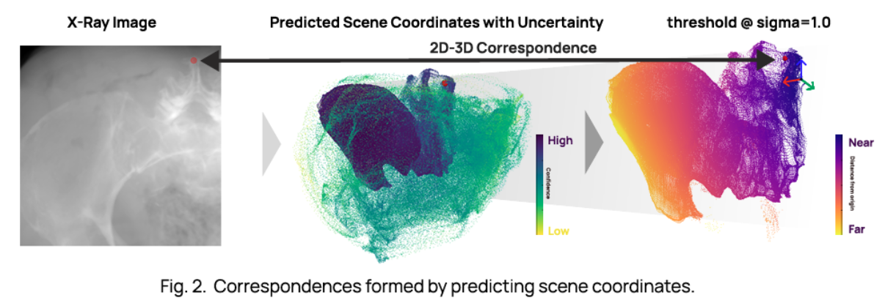

# SCR-Registration
Code Repository for the paper accepted at MICCAI 2023 "X-Ray to CT Rigid Registration Using Scene Coordinate Regression".  
Currently, we provide the test dataset used for a single patient data (VOL-17-1882) from the paper, thus only the inference is supported. Due to the large size of the training dataset, we plan to release the scripts used for generating the simulated data instead. Thanks for your patience.  

## Introduction
SCRNet is a deep learning-based method for rigid registration of X-ray and CT images. The network is trained to regress the scene coordinates of the X-ray image from the CT image. The scene coordinates are then used to compute the correspondences between the X-ray and CT images. The correspondences are used to compute the rigid transformation between the X-ray and CT images. 


## Requirements and Installation
The code is tested on Ubuntu 20.04.6 with RTX 3090 (CUDA 12.0). The following packages are required to run the code:
- Python ^3.9
- Poetry ^1.7.1
We recommend using [pyenv](https://github.com/pyenv/pyenv) to manage the Python version and [poetry](https://python-poetry.org/) to manage the dependencies.  
Please refer to the official websites for the installation of pyenv and poetry. To install the dependencies, run the following command in the root directory of the repository:
```bash
poetry install
```

## Inference
To run the inference, please download the pretrained models and test dataset from [here](https://drive.google.com/drive/folders/1f2ejSE4arB3GsKGeWu4rDzxB2plG-K0c?usp=sharing) and put it under the `weights` and `data` directory respectively. The folder structure should look something like this.  
```bash
data
└── VOL-17-1882_CIOS_FUSION
    ├── annotations
    ├── correspondences
    ├── images
    ├── pelvis_in_world_coordinate.stl
    └── test.json├── data
│   └── VOL-17-1882_CIOS_FUSION
```
and  
```bash
weights
├── DFLNet
│   └── VOL-17-1882_CIOS_FUSION.ckpt
├── PoseNet
│   └── VOL-17-1882_CIOS_FUSION.ckpt
└── SCRNet
    └── VOL-17-1882_CIOS_FUSION.ckpt
```
Then, run the following command:
```bash
poetry run python run_inference.py --config configs/test/SCRNet/VOL-17-1882_CIOS_FUSION.yaml
```
The results will be saved under the `results` directory.  
To show the evaluation results, run the following command:
```bash
poetry run python eval_metrics.py --config results/SCRNet/VOL-17-1882_CIOS_FUSION
```

## Acknowledgement
We thank the authors of [Automatic annotation of hip anatomy in fluoroscopy for robust and efficient 2D/3D registration](https://link.springer.com/article/10.1007/s11548-020-02162-7) for their work on related work on registration and open-source code on [DeepFluoroLabeling-IPCAI2020](https://github.com/rg2/DeepFluoroLabeling-IPCAI2020). We also thank the authors of [DeepDRR -- A Catalyst for Machine Learning in Fluoroscopy-guided Procedures]() for their work on realistic X-ray simulation and open-source code on [DeepDRR](https://github.com/arcadelab/deepdrr). Please refer to their repositories for more details.

## Citation
If you find this repository useful, please cite our paper:
```
@inproceedings{10.1007/978-3-031-43999-5_74,
title = {X-Ray to CT Rigid Registration Using Scene Coordinate Regression},
author = {Shrestha, Pragyan and Xie, Chun and Shishido, Hidehiko and Yoshii, Yuichi and Kitahara, Itaru},
publisher = {Springer-Verlag},
pages = {781–790}
year = {2023},
isbn = {978-3-031-43998-8},
url = {https://doi.org/10.1007/978-3-031-43999-5_74},
doi = {10.1007/978-3-031-43999-5_74},
}
```
